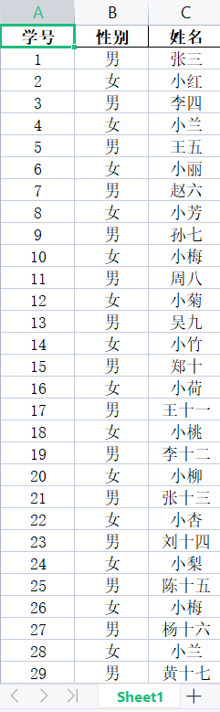
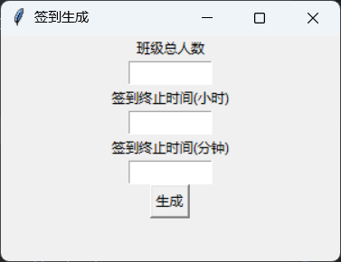

# 班级助手
> 一个班级小助手

## 使用方法

安装依赖

```shell
pip install -r ./requirements.txt
```

启动`bin/launcher.py`即可

## 抽奖

配置 `/data` 目录下的 `prizes.json` 文件，确保该文件内为一个数组后运行 `generated_attendance.py`即可


住： **目前只允许固定每行14个盒子，且窗口大小固定为 1920x1080（防止溢出或留空）**
，如需更改每行盒子数量，请手动编辑 `/main/prizes.py` 文件中 `registered_box` 方法的换行条件

```python
class Box:
    Box.column = 1  # 类变量，用于记录当前列
    ...
    Box.column += 1
    if Box.column > 14:
        Box.column = 1
        Box.row += 2
```

每行15个盒子：

```python
class Box:
    column = 1  # 类变量，用于记录当前列
    ...
    column += 1
    if Box.column > 15:
        Box.column = 1
        Box.row += 2
```

已知问题：奖品较多时，载入速度较慢

## 抽号

请确保 `/data` 目录下存在 `students.xlsx` 文件，文件格式如下图所示



- 请将花名册数据保存到Sheet1中
- 程序会自动识别各列的数据，但请保持首行单元格中必须包含 "学号"、"性别"、 "姓名"三者
- 请将文件命名为students.xlsx并另存为到程序目录下的data目录

## 签到

**住：从 `launcher.py` 启动的签到只是生成签到的工具，生成的签到可以在 `/output` 目录下寻找**

从 `launcher.py` 运行的签到



**注意：小时为24进制**

## TODO

### 建议

1. [ ] 增加签到开机自启动 (开发中)
2. [ ] 计时器 (开发中)

### BUG

1. [ ] 减少奖品过多时的用时 (处理中)

### 已放弃
1. [ ] ~~TUI适配~~

## LICENSE
[MIT](https://mit-license.org/)
